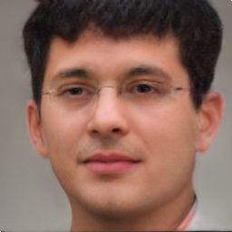
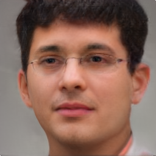
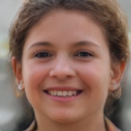
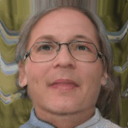
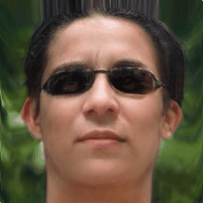
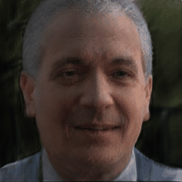
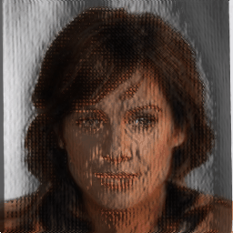
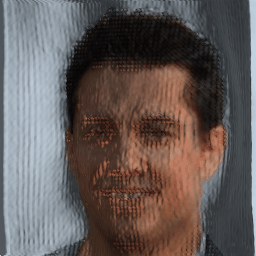
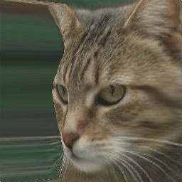

# [Re] - Lifting 2D StyleGAN for 3D-Aware Face Generation
This repository is the re-production implementation of [Lifting 2D StyleGAN for 3D-Aware Face Generation](https://arxiv.org/abs/2011.13126) by [Yichun Shi](https://seasonsh.github.io), [Divyansh Aggarwal](https://divyanshaggarwal.github.io)and Anil K. Jain in the scope of [ML Reproducibility Challenge 2021](https://paperswithcode.com/rc2021).

## Requirements
You can create the conda environment by using:
```setup
conda env create -f environment.yml
```

## Training
### Training from pre-trained StyleGAN2 (FFHQ and AFHQ Cat)
Download pre-trained StyleGAN and face embedding network from [here](https://drive.google.com/file/d/1qVoWu_fps17iTzYptwuN3ptgYeCpIl2e/view?usp=sharing) for training. Unzip them into the `pretrained/` folder. Then you can start training by:
```sh
python tools/train.py config/ffhq_256.py
```

And similarly you can start training for AFHQ Cat by:
```sh
python tools/train.py config/cats_256.py
```

### Training from pre-trained StyleGAN2 (CelebA)
In addition to instructions above download and place `checkpoint_stylegan_celeba` folder under `pretrained/`. Then you can start training by:

And similarly you can start training for AFHQ Cat by:
```sh
python tools/train.py config/celeba_256.py
```

### Training from custom data
As the original repository, we use a re-cropped version of FFHQ to fit the style of our face embedding network. You can find this dataset [here](https://drive.google.com/file/d/1pLHzbZS52XGyejubv5tT0CqhpsocaYuD/view?usp=sharing). The cats dataset can be found [here](https://drive.google.com/file/d/1soEXvvLV0uhasg9GlVhH5YW_9FsAmb3d/view?usp=sharing).
To train a StyleGAN2 from you own dataset, check the content under [`stylegan2-pytorch`](https://github.com/seasonSH/LiftedGAN/tree/main/stylegan2-pytorch) folder. After training a StyleGAN2, you can lift it using the training code.

## Testing
### Original Pre-trained LiftedGAN Models: 
[Google Drive](https://drive.google.com/file/d/1-44Eivt7GHINkX6zox89HHttujYWThz2/view?usp=sharing)

### Reproduced Pre-trained LiftedGAN and StyleGAN2 Models: 
[Google Drive](https://drive.google.com/file/d/1NE8Tfqkr4po63dMnwwnV_Q-mluYgUsLV/view?usp=sharing)

### Sampling random faces
You can generate random samples from a lifted gan by running:
```sh
python tools/generate_images.py /path/to/the/checkpoint --output_dir your/output/dir
```
Make sure the checkpoint file and its `config.py` file are under the same folder.

### Sampling random faces (using same latent vector)
You can generate random samples from 2 different LiftedGANs (whit same latent vector) by running:
```sh
python tools/generate_images_re.py --model_original /path/to/the/checkpoint --model_reproduced /path/to/the/checkpoint --output_dir your/output/dir
```

### Running Viewpoint Manipulation
You can run viewpoint manipulation for a single LiftedGAN by:
```sh
python tools/generate_poses.py /path/to/the/checkpoint --output_dir your/output/dir --type yaw
```


### Running Viewpoint Manipulation (using same latent vector)
You can run viewpoint manipulation by using 2 different LiftedGANs (whit same latent vector) by:
```sh
python tools/generate_poses_re.py --model_original /path/to/the/checkpoint --model_reproduced /path/to/the/checkpoint --output_dir your/output/dir --type yaw
```


### Running Light Direction Manipulation
You can run light direction manipulation for a single LiftedGAN by:
```sh
python tools/generate_lighting.py --model_original /path/to/the/checkpoint --model_reproduced /path/to/the/checkpoint --output_dir your/output/dir
```

### Running Light Direction Manipulation (using same latent vector)
You can run light direction manipulation by using 2 different LiftedGANs (whit same latent vector) by:
```sh
python tools/generate_lighting_re.py --model_original /path/to/the/checkpoint --model_reproduced /path/to/the/checkpoint --output_dir your/output/dir
```


### Running pose interpolation
You can run the command below to interpolate between two face poses:
```sh
python tools/generate_poses_interpolate.py /path/to/the/checkpoint --output_dir your/output/dir
```


### Running pose interpolation  (using same latent vector)
You can run the command below to interpolate between two face poses:
```sh
python tools/generate_poses_interpolate_re.py --model_original /path/to/the/checkpoint --model_reproduced /path/to/the/checkpoint --output_dir your/output/dir --type yaw
```


For all experiments make sure the checkpoint file and its `config.py` file are under the same folder. For viewpoint manipulation experiments you can change the type parameter to toggle between yaw and pitch manipulation.


### Testing FID
We use the code from rosinality's stylegan2-pytorch to compute FID. To compute the FID, you first need to compute the statistics of real images:
```sh
python utils/calc_inception.py /path/to/the/dataset/lmdb
```
You might skip this step if you are using our pre-calculated statistics file ([link](https://drive.google.com/file/d/1qVoWu_fps17iTzYptwuN3ptgYeCpIl2e/view?usp=sharing)). Then, to test the FID, you can run:
```sh
python tools/test_fid.py /path/to/the/checkpoint --inception /path/to/the/inception/file
```

## Additional Results of Our Reproduction Paper

### FFHQ Experiments

#### Face Generation
| Original | Reproduced |
|----------|------------|
|  |  |
|  |  |
|  |  |
|  |  |
|  |  |
|  |  |
|  |  |
|  |  |

### Viewpoint Manipulation (yaw)
| Original | Reproduced |
|----------|------------|
|  | |
|  | |
|  | |
|  | |
|  | |
|  | |
|  | |
|  | |

### Viewpoint Manipulation (pitch)
| Original | Reproduced |
|----------|------------|
|  |  |
|  |  |
|  |  |
|  |  |
|  |  |
|  |  |
|  |  |
|  |  |

### Re-lighting
| Original | Reproduced |
|----------|------------|
|  |  |
|  |  |
|  |  |
|  |  |
|  |  |
|  |  |
|  |  |
|  |  |

### CelebA Experiments

| Face Generation | Viewpoint Manipulation (yaw) | Viewpoint Manipulation (pitch) | Re-lighting |
|-----------------|------------------------------|--------------------------------|-------------|
|||||
|||||
|||||
|||||
|||||
|||||
|||||
|||||

### AFHQ Cat Experiments

#### Face Generation
| Original | Reproduced |
|----------|------------|
|  |  |
|  |  |
|  |  |
|  |  |
|  |  |
|  |  |

### Viewpoint Manipulation (yaw)
| Original | Reproduced |
|----------|------------|
|  | |
|  | |
|  | |
|  | |
|  | |
|  | |

### Viewpoint Manipulation (pitch)
| Original | Reproduced |
|----------|------------|
|  |  |
|  |  |
|  |  |
|  |  |
|  |  |
|  |  |


### Re-lighting
| Original | Reproduced |
|----------|------------|
|  |  |
|  |  |
|  |  |
|  |  |
|  |  |
|  |  |

