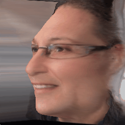

# [Re] - Lifting 2D StyleGAN for 3D-Aware Face Generation

This repository is the re-production implementation of [Lifting 2D StyleGAN for 3D-Aware Face Generation](https://arxiv.org/abs/2011.13126) by [Yichun Shi](https://seasonsh.github.io), [Divyansh Aggarwal](https://divyanshaggarwal.github.io)and Anil K. Jain in the scope of [ML Reproducibility Challenge 2021](https://paperswithcode.com/rc2021).
<!---
Authored by [Doğa Yılmaz](https://yilmazdoga.com), [Furkan Kınlı](https://birdortyedi.github.io/), Barış Özcan, [Furkan Kıraç](http://fkirac.net/).
--->

## Requirements

You can create the conda environment by using:
```setup
conda env create -f environment.yml
```

## Training
### Training from pre-trained StyleGAN2
Download our pre-trained StyleGAN and face embedding network from [here](https://drive.google.com/file/d/1qVoWu_fps17iTzYptwuN3ptgYeCpIl2e/view?usp=sharing) for training. Unzip them into the `pretrained/` folder. Then you can start training by:
```sh
python tools/train.py config/ffhq_256.py
```

### Training from custom data
We use a re-cropped version of FFHQ to fit the style of our face embedding network. You can find this dataset [here](https://drive.google.com/file/d/1pLHzbZS52XGyejubv5tT0CqhpsocaYuD/view?usp=sharing). The cats dataset can be found [here](https://drive.google.com/file/d/1soEXvvLV0uhasg9GlVhH5YW_9FsAmb3d/view?usp=sharing).
To train a StyleGAN2 from you own dataset, check the content under [`stylegan2-pytorch`](https://github.com/seasonSH/LiftedGAN/tree/main/stylegan2-pytorch) folder. After training a StyleGAN2, you can lift it using our training code.

## Testing
### Pre-trained Models: 
[Google Drive](https://drive.google.com/file/d/1-44Eivt7GHINkX6zox89HHttujYWThz2/view?usp=sharing)
### Sampling random faces
You can generate random samples from a lifted gan by running:
```sh
python tools/generate_images.py /path/to/the/checkpoint --output_dir results/
```
Make sure the checkpoint file and its `config.py` file are under the same folder.

### Testing FID
We use the code from rosinality's stylegan2-pytorch to compute FID. To compute the FID, you first need to compute the statistics of real images:
```sh
python utils/calc_inception.py /path/to/the/dataset/lmdb
```
You might skip this step if you are using our pre-calculated statistics file ([link](https://drive.google.com/file/d/1qVoWu_fps17iTzYptwuN3ptgYeCpIl2e/view?usp=sharing)). Then, to test the FID, you can run:
```sh
python tools/test_fid.py /path/to/the/checkpoint --inception /path/to/the/inception/file
```

## Additional Results to Our Reproduction Paper

### FFHQ Experiments

#### Faces Yaw
| Original | Reproduced |
|----------|------------|
|  |  |
|  |  |
|  |  |
|  |  |
|  |  |
|  |  |
|  |  |
|  |  |


### Faces Yaw
| Original | Reproduced |
|----------|------------|
|  | |
|  | |
|  | |
|  | |
|  | |
|  | |
|  | |
|  | |


### Faces Pitch
| Original | Reproduced |
|----------|------------|
|  |  |
|  |  |
|  |  |
|  |  |
|  |  |
|  |  |
|  |  |
|  |  |

### Faces Lighting
| Original | Reproduced |
|----------|------------|
|  |  |
|  |  |
|  |  |
|  |  |
|  |  |
|  |  |
|  |  |
|  |  |

### CelebA Experiments

| Face Generation | Viewpoint Manipualtion (yaw) | Viewpoint Manipualtion (pitch) | Re-lighting |
|-----------------|------------------------------|--------------------------------|-------------|
|||||
|||||
|||||
|||||
|||||
|||||
|||||
|||||

### AFHQ Cat Experiments

